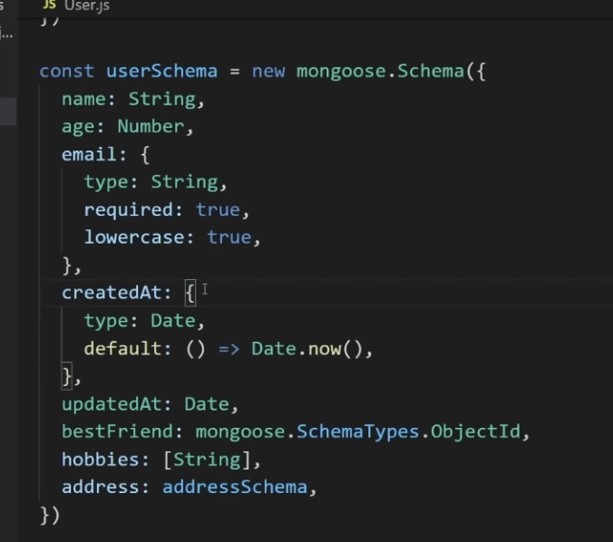

# express
- npm init -y
- npm i --save-dev nodemon

- app = express();
- app.get/post/put/delete/patch(path, callback); callback with threee args req, res, next


- res.status(500).send('hi');
- res.status(200).json({message:"Error"});

- res.download()('server.js');

- most of the time you either send json or render a file in express:

- res.render(file_path)
- res.render('index');
by default all of your view files are going to be searched for in a folder called views

- express Router:
```js
// routes/users.js
const express = require('express');
const router = express.Router();

router.get('/', (req, res) => {
    res.send('users list');
})
router.get('/new', (req, res) => {
    res.send('new users form');
})

module.exports = router;        // default export
// and inside index.js

const userRouter = require('./routes/users');
app.use('/users', userRouter);
``` 

- post request
- dynamic request params:
```js
router.get('/:id/:action', (req, res) => {
    const id = req.params.id;
    const action = req.params.action;
    // res.send('id', id, 'action', action);  // dont send this obviously wrong
    res.send(`id: ${id}, action: ${action}`);
})
```

- these are dynamic routes, you should put static routes above dynamic ones, as the routes are matched with urls top to bottom in the server.js file

- combining multiple routes:
```js
app.route('/birds').get((req, res) => {
res.send('get req');
}).post((res, req) => {
    res.send('post req');

}).delete((res, req) => {
    res.send('delete req');

})
```

The `app.param()` method in Express is a powerful way to handle route parameters. It allows you to define middleware that is executed whenever a specific parameter is present in the URL. This is useful for tasks such as validation, fetching data, or performing any necessary operations before handling the actual request.
```js

router.get('/:id', (req, res) => {
    console.log(`the user is ${req.user}`);
    res.send(`data received is id = ${req.params.id}`);
})
const users = ['bob', 'tom', 'bill'];
router.param('id', (req, res, next, id) => {
    console.log(id);
    req.user = users[id-1];
    next();
})
```

If you send a request to http://localhost:3000/users/2, the following happens:

The router.param('id', ...) middleware is triggered, logging 2 and setting req.user to 'tom'.
Control passes to the main route handler, which logs the user is tom and sends the response data received is id = 2.

## more on middleware
- code that runs between starting and ending of a request.
- every middleware takes res, req , next
- we define middleware like this:
```js
function logger(req, res, next) {
    console.log(req.originalUrl);
    next();
}
// and call it like so:

app.use(logger)
```
- as code runs from top to down the routes before app.use(middleware) wont use middleware, so
    - you can define global middleware at the very top
    - or you can attach middleware to individual routes like so:
    ```js
    app.get('/', logger, logger, middleware2, (req, res) => {...})
    ```
    - you can attach as many as you want

- query params:
    req.query.name for `/users?name=yash`

- parsing form data from forms and json:

# mongoose
- mongoose is the wrapper around mongo db
- npm i mongoose

## 3 concepts
- schema
    - defines the structure your data looks like, of an object
- model
    - is a schema in an actual usable form, so model is like an individual user object
- query
### schema





- one issue with such validation checks is that they are only done in create() or save()

- const user = await User.create({name:'bob'});
- await user.save();
- user.name = 'bill';
- user.save();

### methods learnt so far:
see script2.js

### foreign keys

this ref tells mongoose what model this objectId refers to:


## advanced schema


# curl
`curl [options] [URL]`
```bash
curl -X POST http://localhost:3000/api/items/123/update
    -H "Content-Type: application/json"
     -d '{"key": "value"}'
```
> ## Breakdown of the cURL Command:
- -X POST: Specifies that this is a POST request.
http://localhost:3000/api/items/123/update: The URL where your API is hosted, including the route with parameters.
- -H "Content-Type: application/json": Sets the request header to indicate that you are sending JSON data.
- -d '{"key": "value"}': The actual data payload you're sending in JSON format.


# authentication